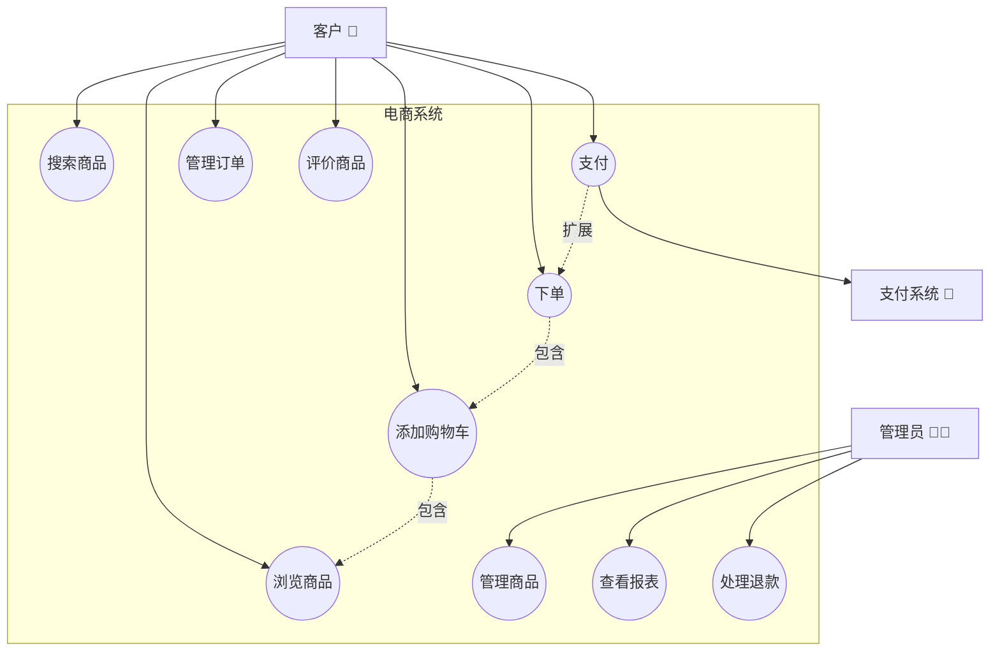
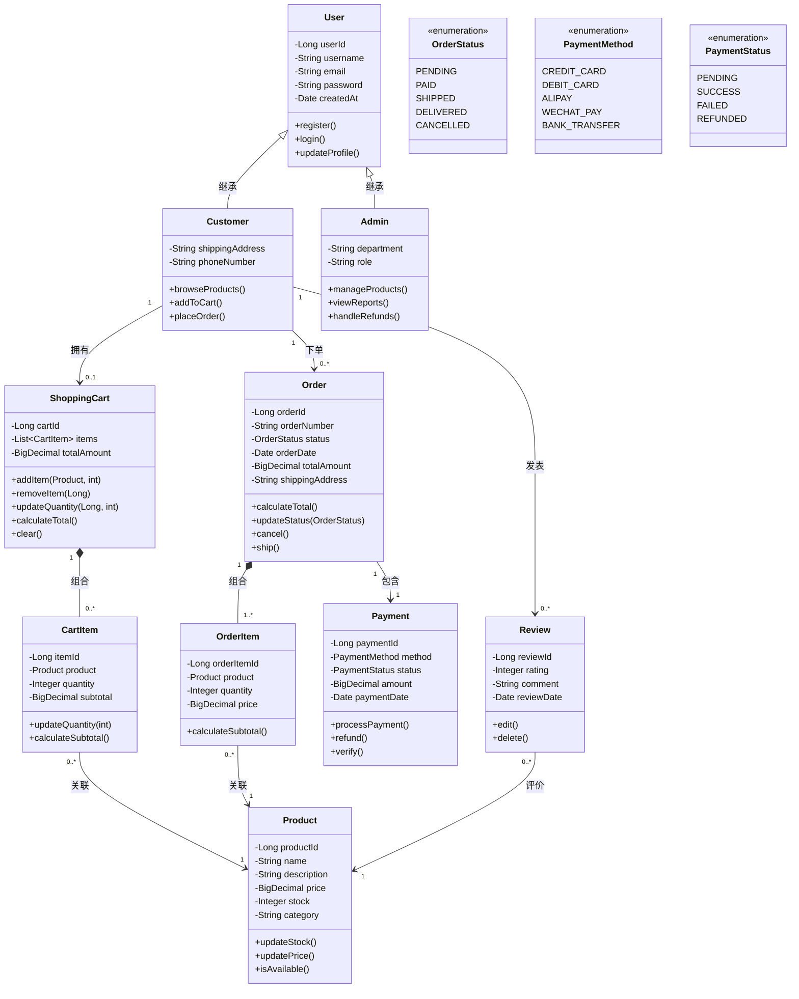
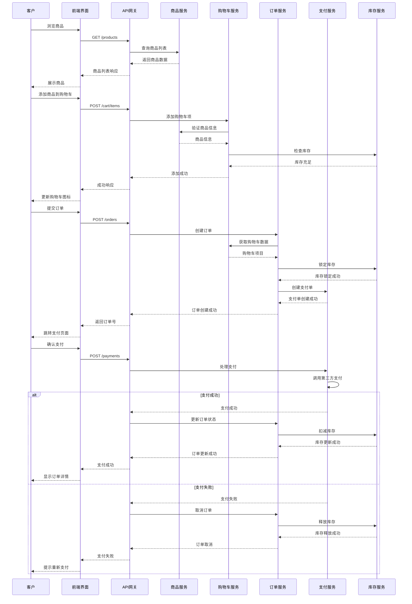
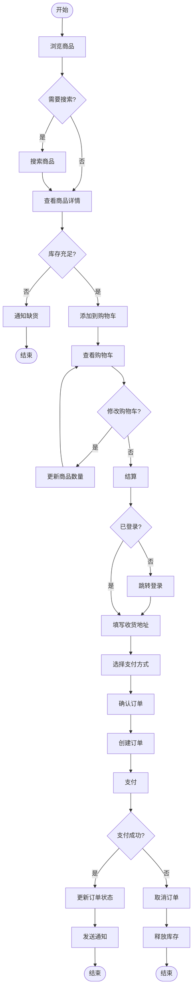
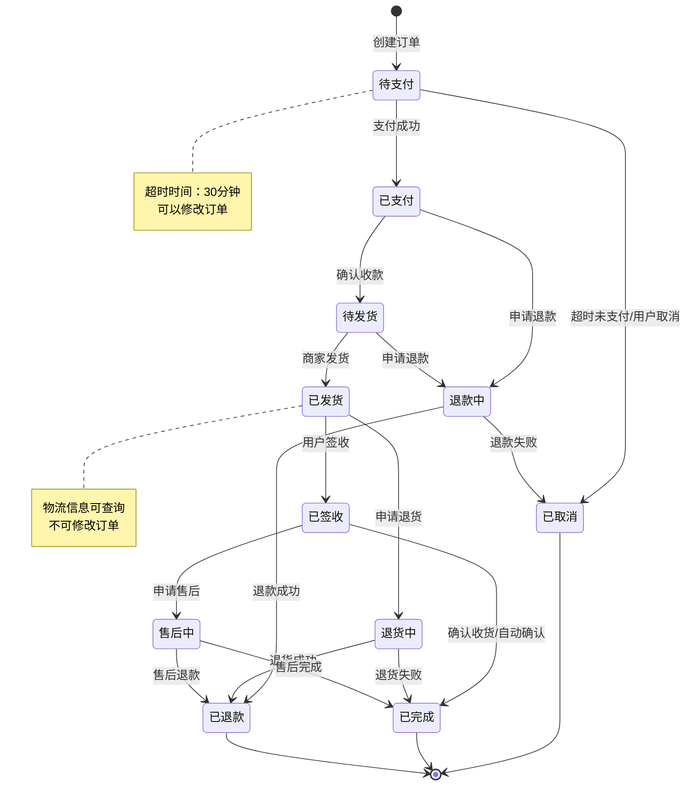
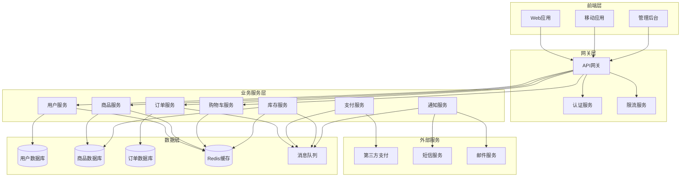
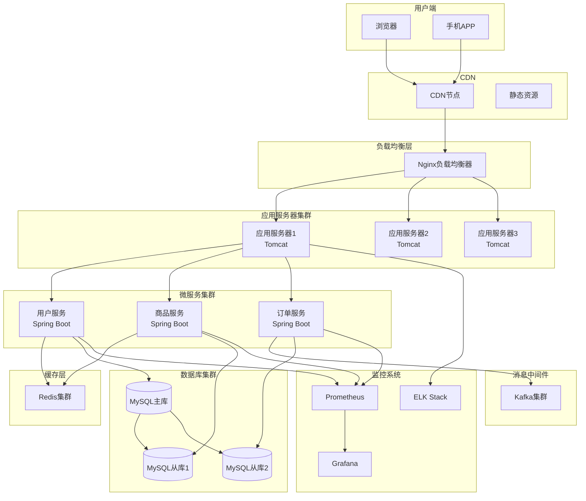
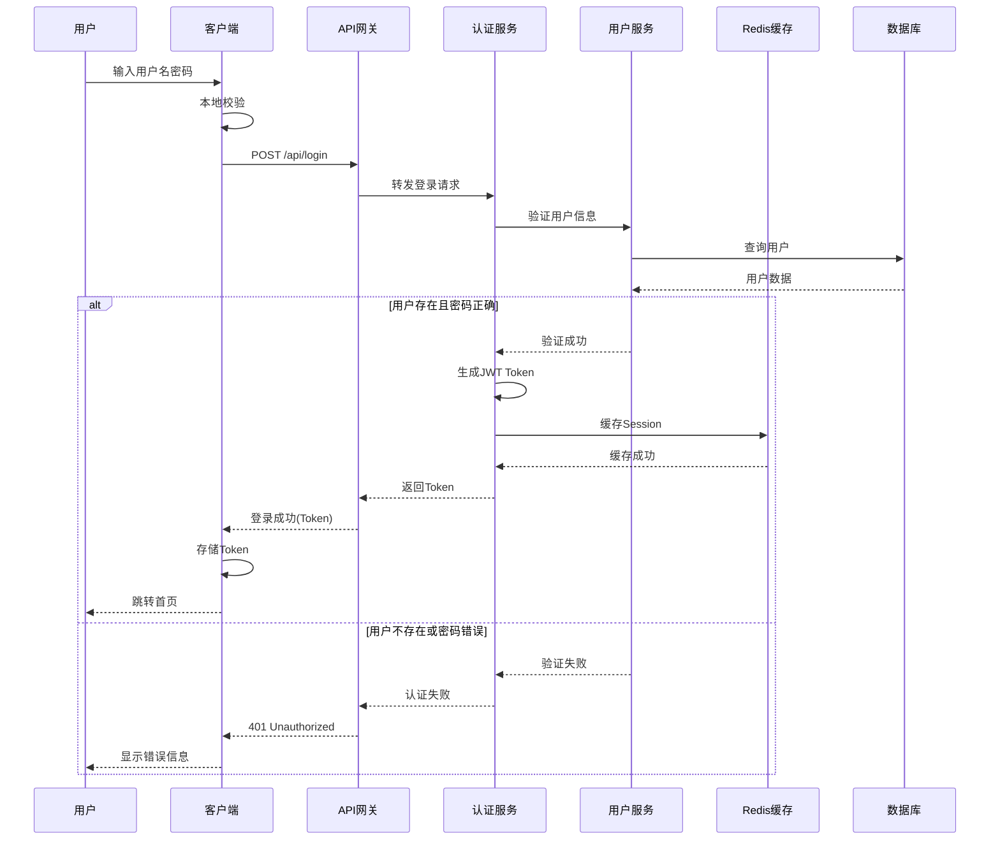

# 标准大厂 UML 图绘制规范 - 电商系统示例

## 1. 用例图 (Use Case Diagram)

### 用途
描述系统功能和用户交互，展示系统边界和参与者。

### 绘制规范
- 参与者用小人图标表示
- 用例用椭圆表示
- 系统边界用矩形框表示
- 包含关系用虚线箭头 + <<include>>
- 扩展关系用虚线箭头 + <<extend>>

## 2. 类图 (Class Diagram)

### 用途
展示系统的静态结构，包括类、属性、方法和关系。

### 绘制规范
- 类用三段矩形表示（类名、属性、方法）
- 属性和方法的可见性：- 私有，+ 公共，# 保护，~ 包级
- 关系类型：
  - 继承：实线空心三角箭头
  - 实现：虚线空心三角箭头
  - 关联：实线箭头
  - 聚合：空心菱形
  - 组合：实心菱形
  - 依赖：虚线箭头

## 3. 序列图 (Sequence Diagram)

### 用途
描述对象之间的交互顺序，展示业务流程的时序关系。

### 绘制规范
- 参与者用矩形框表示
- 生命线用垂直虚线表示
- 同步消息用实线箭头
- 异步消息用开放箭头
- 返回消息用虚线箭头
- 激活框表示对象活跃期

## 4. 活动图 (Activity Diagram)

### 用途
描述业务流程或算法的工作流程，类似流程图但更规范。

### 绘制规范
- 开始/结束用圆角矩形
- 活动用矩形
- 判断用菱形
- 并发用粗横线（分叉和汇合）
- 泳道表示不同参与者的职责

## 5. 状态图 (State Diagram)

### 用途
描述对象的生命周期，展示状态转换。

### 绘制规范
- 状态用圆角矩形表示
- 初始状态用实心圆
- 结束状态用双圆圈
- 转换用箭头表示，标注触发事件
- 可以包含进入/退出动作

## 6. 组件图 (Component Diagram)

### 用途
展示系统的物理架构，组件之间的依赖关系。

### 绘制规范
- 组件用矩形表示，可带组件图标
- 接口用圆圈或棒棒糖表示
- 依赖关系用虚线箭头
- 组件可以嵌套表示包含关系

## 7. 部署图 (Deployment Diagram)

### 用途
展示系统的物理部署架构。

### 绘制规范
- 节点用立方体表示
- 部署的组件用矩形表示
- 通信路径用实线连接
- 可以标注协议和端口

## 8. 时序图最佳实践示例

### 用户登录流程

## UML 绘制总体规范

### 1. 命名规范
- **类名**：使用大驼峰命名法（PascalCase）
- **属性和方法**：使用小驼峰命名法（camelCase）
- **包名**：使用小写字母
- **常量**：使用全大写字母，下划线分隔

### 2. 图形规范
- 保持图形简洁，避免交叉线
- 合理使用颜色区分不同类型的元素
- 添加必要的注释说明
- 控制图形大小，确保可读性

### 3. 关系表示
- **依赖**（Dependency）：虚线箭头 -->
- **关联**（Association）：实线箭头 →
- **聚合**（Aggregation）：空心菱形 ◇→
- **组合**（Composition）：实心菱形 ◆→
- **继承**（Inheritance）：空心三角箭头 ▷→
- **实现**（Implementation）：虚线空心三角箭头 ▷-->

### 4. 文档规范
- 每个图都应有标题和说明
- 复杂的图需要添加图例
- 版本控制和更新记录
- 与代码保持同步

### 5. 工具推荐
- **在线工具**：Draw.io、Lucidchart、PlantUML
- **IDE插件**：IntelliJ IDEA UML插件、Visual Studio Code PlantUML
- **专业工具**：Enterprise Architect、Visual Paradigm、StarUML

### 6. 实践建议
1. **按需绘制**：不是所有项目都需要所有类型的UML图
2. **保持更新**：UML图应该随着代码的变化而更新
3. **团队规范**：制定团队统一的UML绘制规范
4. **适度细节**：避免过度设计，保持适当的抽象层次
5. **版本管理**：将UML图纳入版本控制系统

## 常见错误示例

### ❌ 错误示例
1. 类图中包含过多实现细节
2. 序列图消息顺序混乱
3. 使用非标准的符号表示
4. 图形过于复杂，难以理解
5. 命名不规范，含义不清

### ✅ 正确做法
1. 保持适当的抽象层次
2. 清晰的时序关系
3. 使用标准UML符号
4. 图形简洁，重点突出
5. 命名规范，含义明确

## 总结

UML是软件设计的重要工具，正确使用UML可以：
- 提高团队沟通效率
- 减少设计歧义
- 便于系统维护和扩展
- 作为技术文档的重要组成部分

在电商系统这个例子中，我们展示了各种UML图的实际应用，这些图形可以帮助团队更好地理解系统架构、业务流程和技术实现。记住，UML是为了更好地交流和设计，而不是为了画图而画图。