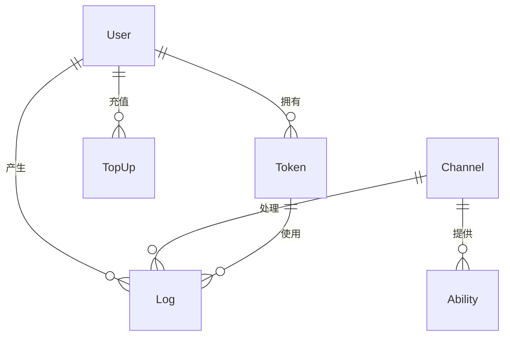

# New API 项目详细说明文档

## 目录

- [项目概述](#项目概述)
- [核心功能](#核心功能)
- [技术架构](#技术架构)
- [系统设计](#系统设计)
- [数据模型](#数据模型)
- [API 接口](#api-接口)
- [部署指南](#部署指南)
- [配置说明](#配置说明)
- [开发指南](#开发指南)
- [常见问题](#常见问题)

## 项目概述

### 项目简介

New API 是一个基于 Go 语言开发的新一代大模型网关与 AI 资产管理系统。它在 [One API](https://github.com/songquanpeng/one-api) 的基础上进行了二次开发，提供了更丰富的功能和更好的用户体验。

### 主要特性

- 🎨 **全新的 UI 界面**：基于 React + Tailwind CSS 的现代化前端
- 🌍 **多语言支持**：支持中文、英文等多语言界面
- 🤖 **30+ AI 平台支持**：兼容 OpenAI、Claude、Gemini 等主流 AI 服务
- 💰 **灵活的计费系统**：支持按次数、按 Token 多种计费模式
- 🔒 **完善的权限管理**：用户组、模型限制、IP 白名单等
- 📊 **数据分析看板**：实时监控使用情况和统计数据
- ⚡ **高性能设计**：多级缓存、批量处理、智能路由

### 项目定位

New API 定位为企业级的 AI 服务聚合网关，适用于：
- 需要统一管理多个 AI 服务的企业
- AI 应用开发者和服务提供商
- 需要成本控制和使用监控的团队
- 希望简化 AI 服务接入的项目

## 核心功能

### 1. AI 服务聚合

#### 支持的 AI 平台

- **OpenAI 系列**：GPT-4、GPT-3.5、DALL-E、Whisper
- **Anthropic**：Claude 系列模型
- **Google**：Gemini、PaLM
- **国内平台**：百度文心、阿里通义千问、智谱 AI、讯飞星火
- **开源模型**：通过 Ollama、Xinference 支持
- **特色服务**：Midjourney、Suno、Rerank 模型

#### 统一接口设计

所有 AI 服务都通过 OpenAI 兼容的 API 格式访问：
```
POST /v1/chat/completions
POST /v1/embeddings
POST /v1/images/generations
POST /v1/audio/transcriptions
```

### 2. 智能路由系统

#### 渠道选择策略

1. **优先级路由**：按渠道优先级顺序选择
2. **加权随机**：基于权重的随机负载均衡
3. **故障转移**：自动检测并切换故障渠道
4. **模型匹配**：根据请求模型自动选择支持的渠道

#### 多密钥管理

- 单渠道支持配置多个 API 密钥
- 支持轮询、随机等密钥选择策略
- 独立的密钥状态管理

### 3. 用户与权限管理

#### 用户体系

- **多种认证方式**：本地账号、OAuth（GitHub、微信、Telegram）、OIDC
- **角色管理**：管理员、普通用户
- **用户组**：基于组的权限隔离

#### 权限控制

- **API Token 管理**：创建、管理多个 API 令牌
- **模型限制**：限制令牌可使用的模型
- **IP 白名单**：限制令牌的访问来源
- **额度管理**：设置和控制使用额度

### 4. 计费与充值系统

#### 计费模式

- **按 Token 计费**：根据实际使用的 Token 数量
- **按次数计费**：每次请求固定费用
- **倍率设置**：不同模型、用户组的差异化定价

#### 充值方式

- **在线支付**：集成易支付、Stripe
- **兑换码**：生成和使用充值兑换码
- **管理员充值**：后台直接调整用户余额

### 5. 监控与分析

#### 数据看板

- **实时统计**：请求量、Token 使用量、费用统计
- **趋势分析**：按时间维度的使用趋势
- **渠道分析**：各渠道的使用情况和性能

#### 日志系统

- **详细日志**：记录每次 API 调用的详细信息
- **错误追踪**：快速定位和分析错误
- **审计功能**：完整的操作审计记录

### 6. 高级功能

#### 缓存系统

- **提示缓存**：支持 OpenAI、Claude 等平台的缓存计费
- **响应缓存**：减少重复请求的成本
- **多级缓存**：内存缓存 + Redis 分布式缓存

#### 敏感词过滤

- **请求过滤**：过滤请求中的敏感内容
- **响应过滤**：过滤响应中的敏感内容
- **自定义词库**：支持自定义敏感词列表

#### 流式响应

- **SSE 支持**：Server-Sent Events 流式传输
- **WebSocket**：实时通信（如 OpenAI Realtime API）
- **流式计费**：准确计算流式响应的 Token 使用

## 技术架构

### 整体架构

```
┌─────────────────────────────────────────────────┐
│                  客户端应用                      │
├─────────────────────────────────────────────────┤
│                  API 网关                        │
│         (认证、限流、路由、监控)                 │
├─────────────────────────────────────────────────┤
│                 业务逻辑层                       │
│    (用户管理、计费、日志、统计)                  │
├─────────────────────────────────────────────────┤
│              AI 服务适配层                       │
│    (30+ AI 平台的统一适配)                       │
├─────────────────────────────────────────────────┤
│                 数据存储层                       │
│    (MySQL/PostgreSQL/SQLite + Redis)            │
└─────────────────────────────────────────────────┘
```

### 技术栈

#### 后端技术

- **编程语言**：Go 1.21+
- **Web 框架**：Gin
- **ORM 框架**：GORM
- **数据库**：MySQL/PostgreSQL/SQLite
- **缓存**：Redis + 内存缓存
- **认证**：JWT
- **并发处理**：Goroutine + Channel

#### 前端技术

- **框架**：React 18
- **UI 库**：Tailwind CSS + Semantic UI
- **状态管理**：Context API + useReducer
- **构建工具**：Vite
- **国际化**：i18next

### 核心设计模式

#### 1. 适配器模式

将不同 AI 平台的 API 适配为统一接口：

```go
type Adaptor interface {
    GetRequestURL() string
    ConvertRequest(request *dto.GeneralOpenAIRequest) (any, error)
    ConvertResponse(response any, request *dto.GeneralOpenAIRequest) (*dto.OpenAIResponse, error)
    DoRequest(request any, info *channel.Channel) (*http.Response, error)
}
```

#### 2. 中间件模式

请求处理链：认证 → 限流 → 日志 → 分发 → 处理

```go
router.Use(
    middleware.RequestId(),
    middleware.Logger(),
    middleware.Recover(),
    middleware.CORS(),
)
```

#### 3. 策略模式

渠道选择策略的灵活切换：

```go
type ChannelSelector interface {
    Select(channels []*Channel, model string) *Channel
}

// 实现：优先级选择器、权重选择器、随机选择器
```

## 系统设计

### 高可用设计

#### 1. 故障转移

- 自动检测渠道可用性
- 失败请求自动重试
- 渠道自动启用/禁用

#### 2. 负载均衡

- 基于权重的请求分发
- 多密钥轮询
- 流量控制和限流

#### 3. 容错机制

- 优雅的错误处理
- 降级策略
- 熔断保护

### 性能优化

#### 1. 缓存策略

- **用户信息缓存**：减少数据库查询
- **渠道信息缓存**：加速路由选择
- **令牌验证缓存**：提高认证效率

#### 2. 批量处理

- 批量更新用户额度
- 批量写入日志
- 异步任务处理

#### 3. 连接池

- 数据库连接池
- HTTP 客户端连接池
- Redis 连接池

### 安全设计

#### 1. 认证授权

- JWT Token 认证
- API 密钥管理
- OAuth 2.0 支持

#### 2. 数据安全

- 密码加密存储（bcrypt）
- 敏感信息加密（AES）
- HTTPS 传输加密

#### 3. 访问控制

- IP 白名单
- 请求频率限制
- 模型访问权限

## 数据模型

### 核心实体关系



### 主要数据表

#### users 表
- 存储用户基本信息
- 支持多种登录方式
- 管理用户额度和权限

#### channels 表
- AI 服务渠道配置
- 支持多密钥管理
- 记录使用统计

#### tokens 表
- API 访问令牌
- 细粒度的权限控制
- 使用量追踪

#### logs 表
- 详细的请求日志
- 支持多维度查询
- 独立的日志数据库

## API 接口

### RESTful API 设计

#### 认证接口
```
POST   /api/user/register    # 用户注册
POST   /api/user/login       # 用户登录
GET    /api/user/self        # 获取当前用户信息
```

#### 管理接口
```
GET    /api/channel          # 获取渠道列表
POST   /api/channel          # 创建渠道
PUT    /api/channel/{id}     # 更新渠道
DELETE /api/channel/{id}     # 删除渠道

GET    /api/token            # 获取令牌列表
POST   /api/token            # 创建令牌
DELETE /api/token/{id}       # 删除令牌
```

#### AI 服务接口（OpenAI 兼容）
```
POST   /v1/chat/completions  # 聊天补全
POST   /v1/embeddings        # 文本嵌入
POST   /v1/images/generations # 图像生成
POST   /v1/audio/transcriptions # 音频转文字
```

### 请求示例

#### 聊天补全请求
```bash
curl -X POST https://api.example.com/v1/chat/completions \
  -H "Authorization: Bearer sk-xxx" \
  -H "Content-Type: application/json" \
  -d '{
    "model": "gpt-4",
    "messages": [
      {"role": "user", "content": "Hello, AI!"}
    ],
    "stream": true
  }'
```

## 部署指南

### 系统要求

- **操作系统**：Linux、macOS、Windows
- **Go 版本**：1.21+
- **数据库**：MySQL 5.7+ / PostgreSQL 9.6+ / SQLite 3
- **Redis**：6.0+（可选）

### Docker 部署（推荐）

#### 1. 使用 Docker Compose

```yaml
version: '3.8'
services:
  new-api:
    image: calciumion/new-api:latest
    ports:
      - "3000:3000"
    environment:
      - SQL_DSN=root:password@tcp(mysql:3306)/new_api
      - REDIS_CONN_STRING=redis://redis:6379
      - SESSION_SECRET=your-secret-key
    depends_on:
      - mysql
      - redis
    volumes:
      - ./data:/data

  mysql:
    image: mysql:8.0
    environment:
      - MYSQL_ROOT_PASSWORD=password
      - MYSQL_DATABASE=new_api
    volumes:
      - mysql_data:/var/lib/mysql

  redis:
    image: redis:7-alpine
    volumes:
      - redis_data:/data

volumes:
  mysql_data:
  redis_data:
```

#### 2. 启动服务

```bash
docker-compose up -d
```

### 源码部署

#### 1. 克隆项目

```bash
git clone https://github.com/Calcium-Ion/new-api.git
cd new-api
```

#### 2. 编译后端

```bash
go mod download
go build -o new-api
```

#### 3. 编译前端

```bash
cd web
npm install
npm run build
```

#### 4. 启动服务

```bash
./new-api --port 3000 --log-dir ./logs
```

### 反向代理配置

#### Nginx 配置示例

```nginx
server {
    listen 80;
    server_name api.example.com;

    location / {
        proxy_pass http://localhost:3000;
        proxy_set_header Host $host;
        proxy_set_header X-Real-IP $remote_addr;
        proxy_set_header X-Forwarded-For $proxy_add_x_forwarded_for;
        proxy_set_header X-Forwarded-Proto $scheme;
        
        # WebSocket 支持
        proxy_http_version 1.1;
        proxy_set_header Upgrade $http_upgrade;
        proxy_set_header Connection "upgrade";
        
        # SSE 支持
        proxy_buffering off;
        proxy_cache off;
    }
}
```

## 配置说明

### 环境变量配置

#### 基础配置

```bash
# 端口配置
PORT=3000

# 数据库配置
SQL_DSN="user:password@tcp(localhost:3306)/new_api"

# Redis 配置
REDIS_CONN_STRING="redis://localhost:6379"

# Session 密钥
SESSION_SECRET="your-secret-key"

# 日志目录
LOG_DIR="./logs"
```

#### 高级配置

```bash
# 流式响应超时（秒）
STREAMING_TIMEOUT=300

# 启用内存缓存
MEMORY_CACHE_ENABLED=true

# 批量更新间隔（秒）
BATCH_UPDATE_INTERVAL=10

# 渠道重试次数
CHANNEL_RETRY_TIMES=3

# 启用敏感词过滤
SENSITIVE_WORDS_ENABLED=true

# 加密密钥
CRYPTO_SECRET="your-crypto-secret"
```

### 系统设置

通过管理后台可以配置：

- **运营设置**：注册开关、默认额度、邀请奖励
- **计费设置**：模型倍率、缓存计费比例
- **限流设置**：请求频率限制、并发限制
- **通知设置**：邮件通知、Webhook 配置

## 开发指南

### 项目结构

```
new-api/
├── main.go              # 程序入口
├── common/              # 公共工具库
├── constant/            # 常量定义
├── controller/          # 控制器层
├── dto/                 # 数据传输对象
├── middleware/          # 中间件
├── model/               # 数据模型
├── relay/               # AI 服务适配
│   └── channel/         # 各平台适配器
├── router/              # 路由定义
├── service/             # 业务服务
├── setting/             # 配置管理
└── web/                 # 前端代码
    ├── src/
    │   ├── components/  # React 组件
    │   ├── pages/       # 页面组件
    │   └── helpers/     # 工具函数
    └── public/          # 静态资源
```

### 添加新的 AI 平台

#### 1. 创建适配器

在 `relay/channel/` 下创建新的适配器目录：

```go
// relay/channel/newplatform/adaptor.go
type Adaptor struct {
    *BaseAdaptor
}

func (a *Adaptor) GetRequestURL() string {
    return "https://api.newplatform.com/v1/chat"
}

func (a *Adaptor) ConvertRequest(request *dto.GeneralOpenAIRequest) (any, error) {
    // 转换请求格式
}

func (a *Adaptor) ConvertResponse(response any, request *dto.GeneralOpenAIRequest) (*dto.OpenAIResponse, error) {
    // 转换响应格式
}
```

#### 2. 注册适配器

在 `relay/relay_adaptor.go` 中注册：

```go
func GetAdaptor(channelType int) Adaptor {
    switch channelType {
    case common.ChannelTypeNewPlatform:
        return &newplatform.Adaptor{}
    // ...
    }
}
```

#### 3. 添加渠道类型

在 `constant/channel.go` 中定义：

```go
const (
    ChannelTypeNewPlatform = 30
)
```

### API 开发规范

#### 1. 控制器规范

```go
func GetChannels(c *gin.Context) {
    // 参数验证
    page, _ := strconv.Atoi(c.Query("page"))
    if page < 1 {
        page = 1
    }
    
    // 调用服务
    channels, total, err := model.GetChannels(page, pageSize)
    if err != nil {
        c.JSON(http.StatusInternalServerError, gin.H{
            "success": false,
            "message": err.Error(),
        })
        return
    }
    
    // 返回响应
    c.JSON(http.StatusOK, gin.H{
        "success": true,
        "data":    channels,
        "total":   total,
    })
}
```

#### 2. 错误处理

```go
// 使用统一的错误码
if err != nil {
    switch err {
    case model.ErrRecordNotFound:
        c.JSON(http.StatusNotFound, gin.H{
            "error": common.ErrorCodeNotFound,
            "message": "资源不存在",
        })
    default:
        c.JSON(http.StatusInternalServerError, gin.H{
            "error": common.ErrorCodeInternalError,
            "message": "服务器内部错误",
        })
    }
}
```

### 测试指南

#### 单元测试

```go
func TestConvertRequest(t *testing.T) {
    adaptor := &Adaptor{}
    request := &dto.GeneralOpenAIRequest{
        Model: "gpt-4",
        Messages: []dto.Message{
            {Role: "user", Content: "Hello"},
        },
    }
    
    converted, err := adaptor.ConvertRequest(request)
    assert.NoError(t, err)
    assert.NotNil(t, converted)
}
```

#### 集成测试

```bash
# 运行所有测试
go test ./...

# 运行特定包的测试
go test ./relay/channel/openai

# 运行基准测试
go test -bench=. ./...
```

## 常见问题

### 部署相关

**Q: 如何设置 HTTPS？**
A: 建议使用 Nginx 反向代理配合 Let's Encrypt 证书。

**Q: 多机部署需要注意什么？**
A: 必须配置相同的 SESSION_SECRET 和 CRYPTO_SECRET，共享 Redis 实例。

**Q: 如何备份数据？**
A: 定期备份数据库和 /data 目录（如果使用 SQLite）。

### 使用相关

**Q: 如何提高系统性能？**
A: 
1. 启用 Redis 缓存
2. 适当增加批量更新间隔
3. 合理配置数据库连接池
4. 使用 CDN 加速前端资源

**Q: 渠道经常失败怎么办？**
A: 
1. 检查 API 密钥是否有效
2. 确认余额是否充足
3. 查看错误日志定位问题
4. 适当增加重试次数

**Q: 如何实现高并发？**
A:
1. 使用多个渠道分担负载
2. 配置合理的权重分配
3. 启用请求缓存
4. 优化数据库查询

### 开发相关

**Q: 如何调试 AI 请求？**
A: 在渠道配置中开启调试模式，查看详细的请求和响应日志。

**Q: 如何添加新功能？**
A: 遵循现有的代码结构，在相应的层添加代码，确保测试通过。

**Q: 前端开发如何联调？**
A: 使用 Vite 的代理功能，将 API 请求代理到后端服务。

## 总结

New API 是一个功能完善、设计精良的 AI 服务网关系统。它通过统一的接口设计、灵活的路由策略、完善的权限管理，为企业和开发者提供了便捷的 AI 服务接入方案。

项目的主要优势包括：

1. **易用性**：简单的部署流程，友好的管理界面
2. **可扩展性**：模块化设计，易于添加新功能
3. **高性能**：多级缓存、批量处理等优化
4. **安全性**：完善的认证授权和数据保护
5. **可靠性**：故障转移、自动恢复等机制

无论是作为企业的 AI 服务管理平台，还是作为个人项目的 AI 能力支撑，New API 都是一个值得信赖的选择。